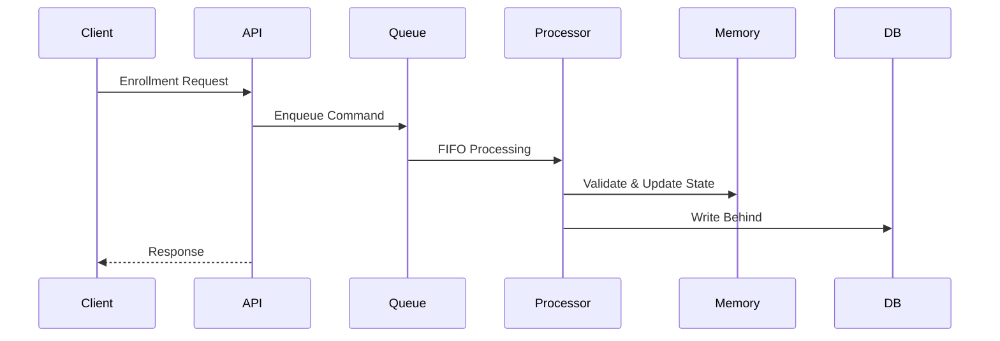

# 수강신청 시스템 V2

> Peak Traffic 환경에서 발생하는 동시성 문제를 분석하고,
> 여러 동시성 제어 전략을 비교·검증하여
> **Single-Threaded Command Processor Architecture**를 설계한 수강신청 시스템 프로젝트


---

# Project Overview

수강신청은 짧은 시간 동안 특정 강의에 요청이 집중되면서도 데이터 정합성을 반드시 보장해야 하는 대표적인 동시성 문제입니다.

이 프로젝트는 단순한 CRUD 구현이 아니라 동일한 도메인에 대해 여러 동시성 제어 전략을 비교하고, 병목을 계측하며 아키텍처를 단계적으로 개선하는 것을 목표로 합니다.

운영 로그를 사용할 수 없는 개인 프로젝트이므로 실제 대학 사례를 참고하여 다음과 같은 환경을 모델링했습니다.

- 재학생 40,000명
- 동시 신청자 16,000명
- 총 요청 80,000건
- Peak Traffic 4,800 TPS

---

# Key Results

| Metric | Result |
|---------|-------:|
| Peak Load | 80,000 Requests |
| System Failure Rate | **48.99% → 0.00%** |
| Critical Mismatch | **13,455 → 0** |
| Dropped Iteration | **52,439 → 0** |
| P99 Latency | **1,223ms → 7.88ms** |

---

# Architecture

## Evolution

```text
Pessimistic Lock
        │
        ▼
Optimistic Lock
        │
        ▼
Partitioned Command Processor
        │
        ▼
Single-Threaded Command Processor
        │
        ▼
Fast Endpoint
```

## Final Request Flow



### Why Single-Threaded Command Processor?

수강신청은 하나의 요청이 학생 시간표와 과목 정원이라는 두 개의 상태를 동시에 변경하는 **Multi-Key Contention** 문제입니다.

- `courseId` 기준으로 분할하면 학생 시간표 검증이 여러 Worker에 분산됩니다.
- `studentId` 기준으로 분할하면 인기 강의의 정원 경쟁이 다시 발생합니다.

이 프로젝트에서는 여러 스레드가 동일한 상태를 동시에 수정하는 대신, 모든 명령(Command)을 하나의 스레드에서 순차적으로 처리하도록 설계했습니다.

이를 통해 Lock 대기와 Retry를 제거하고, 도메인 불변식을 하나의 실행 순서 안에서 보장할 수 있었습니다.

---

# Design Decisions

## 1. Why did DB Lock fail?

Peak Traffic에서는 SQL 실행 시간보다 Row Lock 대기가 더 큰 병목이었습니다.

Lock을 기다리는 트랜잭션이 Connection을 반환하지 못하면서 HikariCP가 포화되었고, 결과적으로 Connection Pool Exhaustion이 발생했습니다.

---

## 2. Why redesign the load test?

초기 Peak 테스트에서는 일부 시나리오가 이전 요청의 성공 여부에 의존하고 있었습니다.

테스트 데이터를 독립적으로 재구성하여 Peak 환경에서도 항상 동일한 도메인 검증이 가능하도록 개선했습니다.

---

## 3. Why not partition by courseId?

단일 Key 기준 파티셔닝은 처리량은 높일 수 있지만 도메인 불변식을 하나의 Worker에서 보장하지 못했습니다.

여러 파티셔닝 전략을 비교한 결과, Single-Threaded Command Processor가 가장 단순하게 데이터 정합성을 유지할 수 있었습니다.

---

## 4. Why profile before optimizing?

Single-Threaded Command Processor가 병목이라고 예상했지만 실제 CPU Profile은 달랐습니다.

Java Flight Recorder(JFR)를 통해 CPU 사용량을 분석한 결과 대부분의 비용은 Spring MVC 요청 처리와 Serialization에서 발생했습니다.

이후 HTTP 처리 경로를 개선하여 Drop 0건과 P99 7.88ms를 달성했습니다.

---

# Performance Summary

| Stage | Result |
|---------|-------------------------------|
| Baseline | DB Lock Contention |
| Optimistic Lock | Retry Overhead |
| Single-Threaded Command Processor | Data Consistency 확보 |
| Final | Failure 0%, Critical Mismatch 0, P99 7.88ms |

---

# Trade-offs

Single-Threaded Command Processor는 하나의 실행 순서에서 모든 명령을 처리하기 때문에 동시성 문제를 단순하게 만들 수 있습니다.

반면 다음과 같은 한계도 존재합니다.

- 단일 스레드 처리량 한계
- 장애 복구 전략 필요
- 메모리 상태 영속화 필요

따라서 본 프로젝트는 운영 환경의 최종 구조가 아니라, 동시성 제어 전략을 검증하기 위한 프로토타입으로 설계했습니다.

---

# Tech Stack

| Category | Stack |
|-----------|----------------|
| Language | Java |
| Framework | Spring Boot, Spring MVC |
| Database | PostgreSQL |
| Concurrency | Pessimistic Lock, Optimistic Lock, Single-Threaded Command Processor |
| Monitoring | Prometheus, Grafana |
| Profiling | Java Flight Recorder |
| Load Test | k6 |
| Infrastructure | Docker Compose |

---

# Project Structure

```text
.
├── src
├── k6
├── monitoring
├── docker
├── scripts
└── README.md
```

---

# Getting Started

## Requirements

- Java 17+
- Docker
- Docker Compose
- k6

## Run

```bash
docker compose up -d
./gradlew bootRun
```

## Load Test

```bash
k6 run k6/enrollment-peak-test.js
```

---

# Lessons Learned

- 성능 최적화는 기술 도입보다 정확한 측정에서 시작된다.
- 동시성 제어는 처리량보다 도메인 불변식을 기준으로 설계해야 한다.
- 프로파일링은 직관보다 신뢰할 수 있는 근거를 제공한다.
- 테스트 코드 역시 운영 코드와 동일한 수준으로 검증되어야 한다.