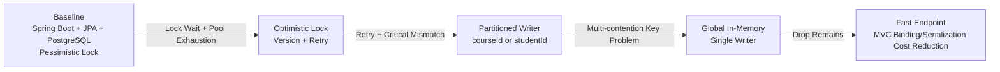
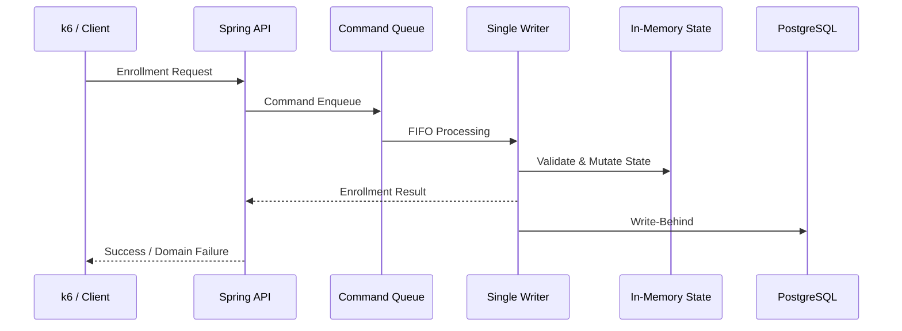

# 수강신청 시스템 V2

> 40,000명 규모의 대학 수강신청 Peak Traffic을 모델링하고, DB Lock 기반 Baseline을 Global In-Memory Single Writer로 개선해 정합성·가용성·응답성 SLO를 검증한 프로젝트


## 1. Project Overview

수강신청 시스템 V2는 단순 CRUD 구현이 아니라, **인기 강의로 요청이 집중되는 상황에서도 정원 초과·중복 신청·시간표 충돌을 허용하지 않는 동시성 제어 구조**를 실험한 프로젝트입니다.

운영 로그가 없는 개인 프로젝트이므로 사용자 규모와 Peak Traffic은 `추정` 모델로 정의했습니다. 재학생 40,000명 중 16,000명이 평균 5개 과목을 신청하고, 첫 10초에 요청의 60%가 몰리는 상황을 80,000건의 부하 테스트로 재현했습니다.

### 핵심 결과

| 지표 | Baseline | Final |
| --- | ---: | ---: |
| System Failure Rate | 48.99% | 0.00% |
| Critical Mismatch | 13,455건 | 0건 |
| Dropped Iteration | 52,439건 | 0건 |
| P99 Latency | 1,223.46ms 이후 병목 재분석 | 7.88ms |

> Baseline 실패율 48.99%는 최종 비교표 기준 실행값입니다. 별도 Peak Baseline 실행에서는 실패율 51.55%, P99 10.4초가 측정되었습니다.

## 2. Motivation (왜 만들었는가?)

수강신청은 트래픽이 짧은 시간에 몰리면서도 데이터 정합성 요구가 매우 강한 도메인입니다.

- 인기 강의의 정원은 절대 초과되면 안 됩니다.
- 같은 학생이 같은 과목을 중복 신청하면 안 됩니다.
- 선수과목 미이수, 기이수 과목, 시간표 충돌은 정확히 거절되어야 합니다.
- Peak Traffic에서도 시스템 실패와 응답 지연을 SLO 안에서 관리해야 합니다.

처음부터 Redis, Queue, 분산 구조를 도입하지 않고, 가장 단순한 Spring Boot + PostgreSQL Baseline을 먼저 만든 뒤 실제 병목을 계측했습니다. 목표는 "빠른 구조"를 상상하는 것이 아니라, **어떤 구조가 왜 실패하는지 측정하고 개선안을 같은 조건에서 검증하는 것**이었습니다.

## 3. Key Features

- 수강신청 도메인 검증
  - 정원 초과 방지
  - 중복 신청 방지
  - 선수과목 미이수 검증
  - 기이수 과목 재신청 방지
  - 시간표 충돌 검증
- 동시성 제어 실험
  - Pessimistic Lock 기반 Baseline
  - Optimistic Lock 비교
  - courseId/studentId 파티셔닝 검토
  - Global In-Memory Single Writer 적용
- 부하 테스트 및 검증
  - k6 기반 80,000건 Peak Traffic 재현
  - Expected/Actual 응답 비교
  - Domain Failure와 System Failure 분리
  - Strict/Critical Mismatch 검증
- 관측 환경
  - HikariCP Active/Pending
  - PostgreSQL Lock Wait
  - P95/P99 Latency
  - Prometheus/Grafana Dashboard
  - JFR CPU Profiling

## 4. Architecture

### Architecture Evolution



### Final Request Flow



### Why Single Writer?

수강신청은 과목 정원과 학생 시간표가 동시에 변경되는 도메인입니다. `courseId`로 나누면 학생 시간표 정합성이 깨질 수 있고, `studentId`로 나누면 인기 과목 정원 경합이 다시 발생합니다.

따라서 여러 스레드가 같은 상태를 경쟁적으로 수정하게 두는 대신, 하나의 Writer가 모든 Command의 순서를 확정하도록 설계했습니다. 이 방식으로 Lock Wait와 CAS Retry를 제거하고, 정합성 판단의 원자성 경계를 명확히 만들었습니다.

## 5. Technical Challenges ⭐

### 5.1 DB Lock이 만든 Connection Pool 고갈

| 관찰 | 값 |
| --- | ---: |
| Peak 목표 | 4,800 TPS |
| Peak Baseline A 실패율 | 51.55% |
| P99 Latency | 10.4초 |
| PK 조회 SQL 실행 시간 | 약 0.2ms |
| Lock Wait Session | 최대 14개 |
| HikariCP Active | 16개 |
| HikariCP Pending | 약 180개 |

처음에는 SQL 성능 문제를 의심했지만, `EXPLAIN ANALYZE` 결과 PK 조회는 약 0.2ms 수준이었습니다. 실제 원인은 Hotspot Row Lock을 기다리는 트랜잭션이 DB Connection을 반환하지 못하고, HikariCP Pool을 포화시키며 대기 요청을 밀어내는 연쇄 병목이었습니다.

### 5.2 Peak 테스트 데이터의 숨은 의존성

Shared Iterations에서는 정상으로 보이던 TIME_CONFLICT 테스트가 Peak Arrival Rate에서는 409가 아닌 200을 반환했습니다.

원인은 애플리케이션이 아니라 테스트 데이터였습니다. 시간표 충돌 상태가 선행 NORMAL 요청의 성공에 의존하고 있었고, Peak 환경에서는 선행 요청이 Drop될 수 있었습니다. 이후 실패 상태를 사전에 Seed하도록 바꾸어 도메인 실패 케이스 16,000건을 독립적으로 검증했습니다.

### 5.3 단일 키 파티셔닝의 한계

| 파티션 기준 | 장점 | 한계 |
| --- | --- | --- |
| courseId | 과목 정원 차감이 한 Worker 안에 모임 | 학생 시간표 충돌이 Worker 경계를 넘음 |
| studentId | 학생별 중복/시간표 검증이 쉬움 | 인기 과목 정원 경합이 다시 발생 |
| Global Single Writer | 모든 불변식을 한 순서에서 검증 | 단일 Writer 장애와 단일 코어 한계 |

실제 courseId 파티셔닝 실험에서는 시간표 충돌 3,086건 중 114건이 잘못 통과했습니다. 이를 단순 구현 오류가 아니라 **다중 경합 키를 가진 도메인의 원자성 경계 문제**로 정의하고 Global Single Writer를 선택했습니다.

### 5.4 직관이 아니라 JFR로 병목 확인

Single Writer 도입 후에도 Drop 2,446건과 P99 1,223.46ms가 남았습니다. 직관적으로는 순차 처리 Writer가 병목처럼 보였지만 JFR 결과는 달랐습니다.

| CPU 비용 | 비중 |
| --- | ---: |
| Spring MVC 요청 처리 | 41.2% |
| JSON Message Converter | 11.2% |
| 응답 처리 | 20.7% |
| Single Writer | 약 1% |

Writer 병렬화보다 Spring MVC 요청·응답 경로를 먼저 줄이는 것이 우선이라고 판단했고, Fast Endpoint와 k6 연결 설정 보정을 통해 최종 Drop 0건, P99 7.88ms를 기록했습니다.

## 6. Performance & Benchmark ⭐

### Test Assumptions

| 항목 | 값 | 성격 |
| --- | ---: | --- |
| 재학생 | 40,000명 | 추정 |
| 동시 행동 사용자 | 16,000명 | 추정 |
| 학생당 신청 | 5과목 | 추정 |
| 총 요청 | 80,000건 | 계산/테스트 데이터 |
| 평균 처리량 | 2,667 TPS | 계산 |
| Peak 처리량 | 4,800 TPS | 계산 |
| Hotspot 강의 | 200개 | 테스트 데이터 |
| Hotspot 요청 | 48,000건 | 테스트 데이터 |

### SLO Result

| SLI | 목표 | 최종 결과 | 판정 |
| --- | ---: | ---: | --- |
| 데이터 정합성 위반 | 0건 | 0건 | PASS |
| Deadlock | 0건 | 0건 | PASS |
| System Failure Rate | 0.5% 이하 | 0.00% | PASS |
| Critical Mismatch | 0건 | 0건 | PASS |
| P95 | 3초 이하 | 0.83ms | PASS |
| P99 | 5초 이하 | 7.88ms | PASS |

### Step-by-Step Benchmark

| 단계 | 처리/지연 | 실패/정합성 |
| --- | --- | --- |
| Controlled Baseline | 934 req/s, P95 660ms, P99 720ms | System Failure 0, Critical Mismatch 0 |
| Peak Baseline A | 성공 29,186건, Drop 50,712건, P99 10.4초 | System Failure 51.55% |
| Peak Baseline B | Drop 52,439건 | Failure 48.99%, Critical Mismatch 13,455건 |
| Optimistic Lock | Drop 0건 | Failure 2.14%, Critical Mismatch 1,708건 |
| Single Writer 1차 | 77,520/80,000건, Drop 2,446건, P99 1,223.46ms | Failure 0, Mismatch 0 |
| Final Single Writer | Drop 0건, P95 0.83ms, P99 7.88ms | Failure 0, Critical Mismatch 0 |

> 최종 수치는 Fast Endpoint와 k6 Connection Reuse/VU 설정 최적화를 포함한 실험값입니다. 운영 인프라에서 동일한 latency를 보장한다는 의미는 아닙니다.

## 7. Tech Stack

| Category | Stack |
| --- | --- |
| Language | Java |
| Framework | Spring Boot, Spring MVC, Spring Data JPA |
| Database | PostgreSQL |
| Concurrency | Pessimistic Lock, Optimistic Lock, In-Memory Single Writer, CompletableFuture, Write-Behind |
| Load Test | k6 |
| Monitoring | Prometheus, Grafana, Spring Actuator, PostgreSQL Exporter |
| Profiling | Java Flight Recorder |
| Infra | Docker Compose |

## 8. Project Structure

```text
.
├── src
│   ├── main
│   │   ├── java
│   │   │   └── ...                 # Spring Boot application
│   │   └── resources
│   │       └── application.yml
│   └── test
├── k6
│   └── ...                         # Load test scenarios
├── monitoring
│   ├── prometheus
│   └── grafana
├── docker-compose.yml
└── README.md
```

> 실제 Repository 구조에 맞게 디렉터리명은 조정해 사용하세요.

## 9. Getting Started

### Prerequisites

- Java 17+
- Docker / Docker Compose
- k6

### Run Application

```bash
docker compose up -d
./gradlew bootRun
```

### Run Test

```bash
./gradlew test
```

### Run Load Test

```bash
k6 run k6/enrollment-peak-test.js
```

### Monitoring

```bash
docker compose up -d prometheus grafana
```

Grafana Dashboard에서 다음 지표를 함께 확인합니다.

- Request Rate
- P95/P99 Latency
- HikariCP Active/Pending
- PostgreSQL Lock Wait
- System Failure Rate
- Critical Mismatch
- Dropped Iteration

## 10. Lessons Learned

1. 성능 개선은 기술 도입이 아니라 실패 기준 정의에서 시작해야 한다.
2. 대시보드의 0을 그대로 믿지 말고 DB 시스템 뷰, 애플리케이션 메트릭, 프로파일러를 교차 검증해야 한다.
3. 부하 테스트 데이터도 제품 코드처럼 검증해야 한다.
4. 파티션 키는 처리량이 아니라 도메인 불변식을 함께 소유할 수 있는지를 기준으로 선택해야 한다.
5. 직관적으로 느린 부분과 실제 CPU를 쓰는 부분은 다를 수 있으므로 JFR 같은 프로파일링 도구로 확인해야 한다.
6. 프로토타입의 성능 검증과 운영 가능한 아키텍처는 다르다. Single Writer를 운영에 적용하려면 WAL, Snapshot, Replication, Leader Election, 멱등 재처리가 필요하다.

## 11. References (ADR, Velog, Portfolio)

### ADR

- [Global In-Memory Single Writer 채택](./docs/adr/global-in-memory-single-writer.md)
- [웹 계층 프로파일링 후 Fast Endpoint 도입](./docs/adr/fast-endpoint-after-profiling.md)

### Velog

- [1-3. Capacity Planning](https://velog.io/)
- [1-4. Mock Data Harness 구축](https://velog.io/)
- [1-7. Peak Traffic 병목 분석](https://velog.io/)
- [1-9. 아키텍처 Single Writer](https://velog.io/)
- [1-10. 병목 식별 및 해결](https://velog.io/)

### Portfolio

- [수강신청 시스템 V2 포트폴리오](../Portfolios/수강신청-시스템-V2-포트폴리오.md)
- [수강신청 V2 성과 지표](../../02_Career_Wiki/Metrics/수강신청-V2-성과-지표.md)
- [수강신청 V2 Evidence Index](../../02_Career_Wiki/Evidence/수강신청-V2-Evidence-Index.md)
